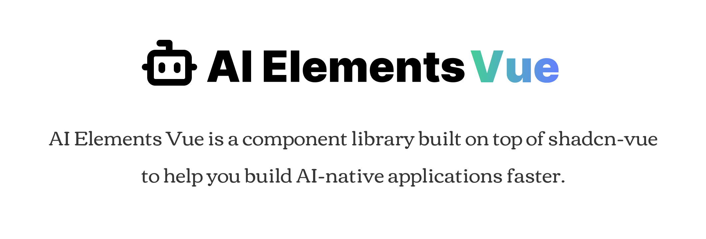

<div align="center">
  
</div>

<br />

<div align="center">
  <a href="https://www.npmjs.com/package/ai-elements-vue" target="\_parent">
    
  </a>
  <a href="#badge">
    
  </a>
  <a href="https://github.com/vuepont/ai-elements-vue" target="\_parent">
    
  </a>
</div>

## Overview

[AI Elements Vue](https://ai-elements-vue.com) provides pre-built, customizable Vue components specifically designed for AI applications, including conversations, messages, code blocks, reasoning displays, and more. The CLI makes it easy to add these components to your Vue.js and Nuxt.js project.

## Installation

You can use the AI Elements Vue CLI directly with npx, or install it globally:

```bash
# Use directly (recommended)
npx ai-elements-vue@latest

# Or using shadcn-vue cli
npx shadcn-vue@latest add https://registry.ai-elements-vue.com/all.json
```

## Prerequisites

Before using AI Elements Vue, ensure your project meets these requirements:

- **Node.js** 18 or later
- **Vue.js, Nuxt.js** project with [AI SDK](https://ai-sdk.dev/) installed
- **shadcn-vue** initialized in your project (`npx shadcn-vue@latest init`)
- **Tailwind CSS** configured (AI Elements Vue supports CSS Variables mode only)

## Usage

### Install All Components

Install all available AI Elements Vue components at once:

```bash
npx ai-elements-vue@latest
```

This command will:
- Set up shadcn-vue if not already configured
- Install all AI Elements Vue components to your configured components directory
- Add necessary dependencies to your project

### Install Specific Components

Install individual or multiple components using the `add` command:

```bash
npx ai-elements-vue@latest add <component-name>

# Or install multiple at once:
npx ai-elements-vue@latest add <name1> <name2> ...
```

Examples:

```bash
# Install the message component
npx ai-elements-vue@latest add message

# Install the conversation component
npx ai-elements-vue@latest add conversation

# Install multiple components in one command
npx ai-elements-vue@latest add message conversation
```

### Alternative: Use with shadcn-vue CLI

You can also install components using the standard shadcn-vue CLI:

```bash
# Install all components
npx shadcn-vue@latest add https://registry.ai-elements-vue.com/all.json

# Install a specific component
npx shadcn-vue@latest add https://registry.ai-elements-vue.com/message.json
```

## Available Components

AI Elements Vue includes the following components:

| Component          | Description                                             |
| ------------------ | ------------------------------------------------------- |
| **Chatbot**        |                                                         |
| `chain-of-thought` | Display AI reasoning and thought processes              |
| `checkpoint`       | Conversation checkpoint component                       |
| `confirmation`     | Tool execution approval workflows                       |
| `context`          | Display Context consumption                             |
| `conversation`     | Container for chat conversations                        |
| `inline-citation`  | Inline source citations                                 |
| `message`          | Individual chat messages with avatars                   |
| `model-selector`   | AI model selection component                            |
| `plan`             | Plan and task planning display component                |
| `prompt-input`     | Advanced input component with model selection           |
| `queue`            | Message and todo queue with attachments                 |
| `reasoning`        | Display AI reasoning and thought processes              |
| `shimmer`          | Text shimmer animation effect                           |
| `sources`          | Source attribution component                            |
| `suggestion`       | Quick action suggestions                                |
| `task`             | Task completion tracking                                |
| `tool`             | Tool usage visualization                                |
| **Workflow**       |                                                         |
| `canvas`           | VueFlow canvas for workflow visualizations            |
| `connection`       | Connection line component for workflow edges            |
| `controls`         | Flow controls for canvas (zoom, fit view, etc.)         |
| `edge`             | Edge component for connections between workflow nodes   |
| `node`             | Node component for workflow graphs                      |
| `panel`            | Panel component for canvas overlays                     |
| `toolbar`          | Node toolbar for workflow elements                      |
| **Vibe-Coding**    |                                                         |
| `artifact`         | Display a code or document                              |
| `web-preview`      | Embedded web page previews                              |
| **Documentation**  |                                                         |
| `open-in-chat`     | Open in chat button for a message                       |
| **Utilities**      |                                                         |
| `code-block`       | Syntax-highlighted code display with copy functionality |
| `image`            | AI-generated image display component                    |
| `loader`           | Loading states for AI operations                        |

## How It Works

The AI Elements Vue CLI:

1. **Detects your package manager** (npm, pnpm, yarn, or bun) automatically
2. **Fetches component registry** from `https://registry.ai-elements-vue.com/all.json`
3. **Installs components** using the shadcn-vue CLI under the hood
4. **Adds dependencies** and integrates with your existing shadcn-vue setup

Components are installed to your configured shadcn-vue components directory (typically `@/components/ai-elements/`) and become part of your codebase, allowing for full customization.

## Configuration

AI Elements Vue uses your existing shadcn-vue configuration. Components will be installed to the directory specified in your `components.json` file.

## Recommended Setup

For the best experience, we recommend:

1. **AI Gateway**: Set up [Vercel AI Gateway](https://vercel.com/docs/ai-gateway) and add `AI_GATEWAY_API_KEY` to your `.env.local`
2. **CSS Variables**: Use shadcn-vue's CSS Variables mode for theming
3. **TypeScript**: Enable TypeScript for better development experience

## Contributing

If you'd like to contribute to AI Elements Vue, please follow these steps:

1. Fork the repository
2. Create a new branch
3. Make your changes to the components in `packages/elements`.
4. Open a PR to the `main` branch.

## Acknowledgments

This project draws inspiration from several excellent projects:

- **[ai-elements](https://ai-sdk.dev/elements)** - AI component concepts
- **[shadcn-vue](https://www.shadcn-vue.com)** - UI component foundation

---

Made with ❤️ by [vuepont](https://github.com/vuepont)
